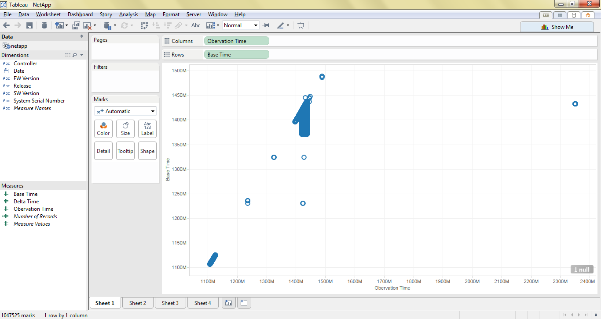
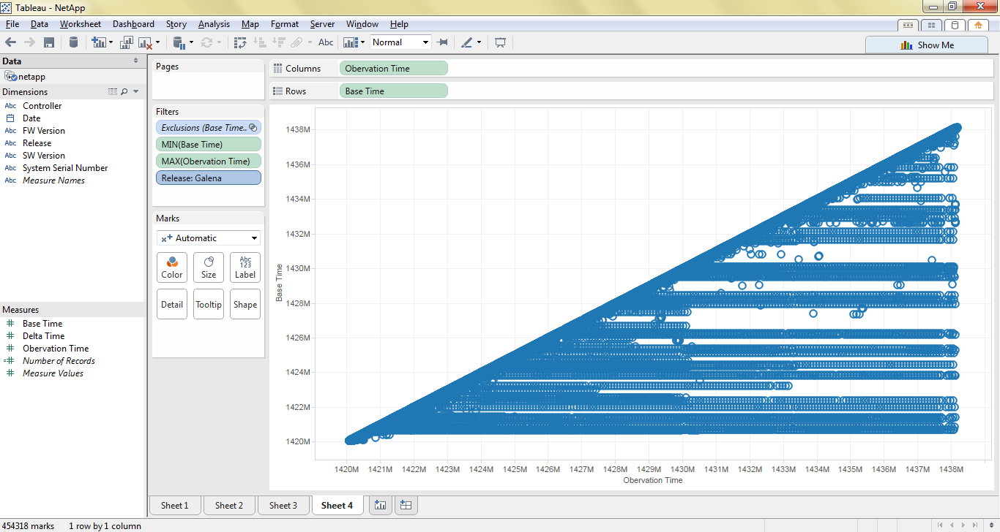
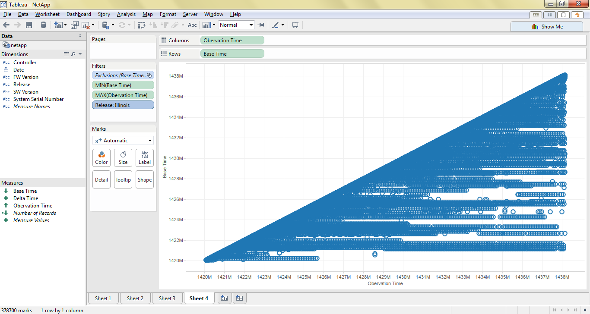
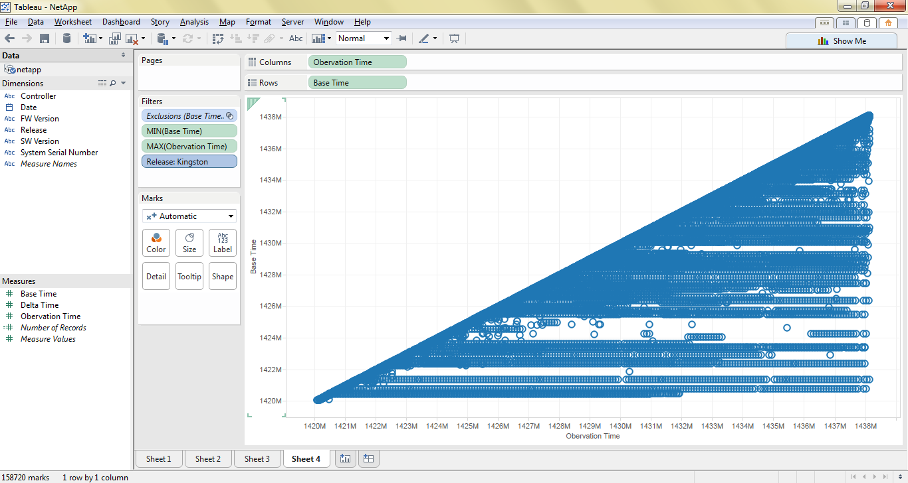

# NetApp

Brian McKean, a senior engineer at NetApp, gave a talk about his company in class.
He shared a data problem for our class to help solve.

# Tool
Tableau

# Authors

This report is prepared by
* [Kari Santos](https://github.com/karisantos)
* [Heather Witte](https://github.com/hswitte)
* [Zachary Lamb](https://github.com/ZachLamb)
* [Fadhil Suhendi](https://github.com/fadhilfath)
* [Denis Kazakov](https://github.com/94kazakov)

# How can the non-incrementing basetime bug be visualized?

I wanted to visualize the relation between basetime and observation time. Given ideal data, this plot should create a diagonal line, where basetimes and observation times are almost perfectly correlated. With a plot of observation time on the x-axis and basetime on the y-axis, systems with non-incrementing basetimes would appear as horizontal stripes on this graph. 

Here is the first plot I made, including all datapoints:

The data for the time frame we are interested in is the blue blob in the middle. The outlying timestamps correspond to dates in 2005 (in the lower left corner) and 2017 (in the upper right corner). Filtering to include only the points whose observation times correspond to the dates contained in the file produces the following chart: 

From this chart you can see that there are many instances of basetimes not incrementing appropriately (evidenced by horizontal-stripes that you can see (kind of) in this graph).

Supposed, this bug has been fixed, but the following series of graphs, which filter on release, show that basetimes are still not incrementing in the latest release (Kingston).

Galena:

Illinois:

Kingston:

# (Question)

(answer)

# (Question)

(answer)

# (Question)

(answer)

# (Question)

(answer)

# Further Analysis

Our team determines the following questions are too complex for Tableau and
require custom scripts to be written.

* (Question)
* (Question)
* (Question)
* (Question)
